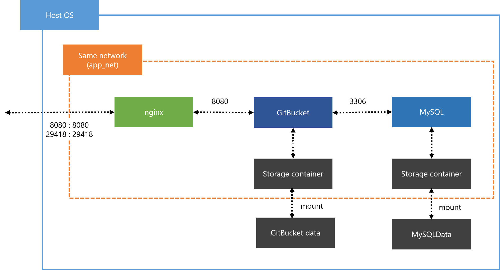
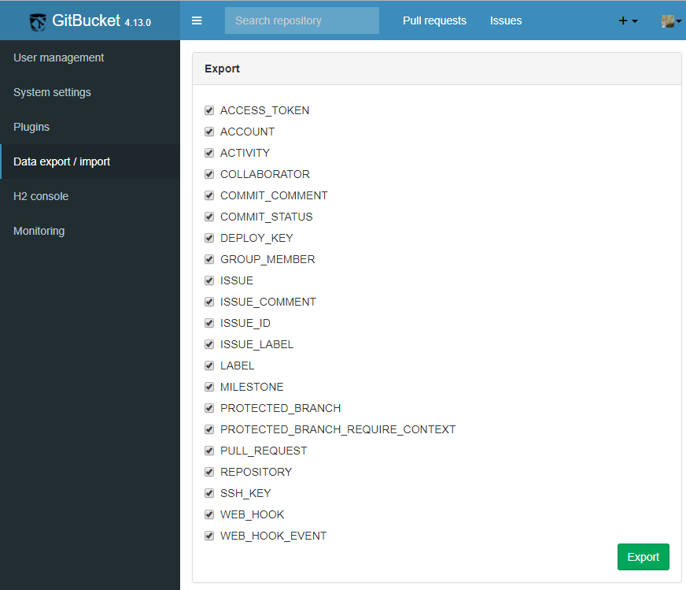

# docker-gitbucket-orchestration


Docker compose for [GitBucket](//github.com/gitbucket/gitbucket).

[日本語の記事はこちら](//yoshinorin.net/2017/02/26/gitbucket-based-on-nginx-mysql-using-by-docker-compose/)

# Architecture

* MySQL
* nginx (Also you can ignore it)

# Requirements

* Higher than Docker compose 3

# Overview



# Install and execute

## Install

* At first. Download `gitbucket.war` using by `gitbucket/gitbucket/war_download.sh`.

## Docker compose up

Please execute below command on `gitbucket` directory.

```sh
docker-compose up -d
```

# Settings

## MySQL

### Character set

Default character set is utf8mb4.

### User and password

**User and paswword are decided when build docker image.** You can specify user and password using by `docker-compose.yml`.

```yml
  gb-mysql:
    build: ./mysql
    container_name: gb-mysql
    environment:
      MYSQL_ROOT_PASSWORD: mypass
      MYSQL_DATABASE: gitbucket
      MYSQL_USER: gitbucket
      MYSQL_PASSWORD: gitbucket
```

You can remove `MYSQL_ROOT_PASSWORD` key in `docker-compose.yml`, after first docker image build.

If you change `MYSQL_USER` and `MYSQL_DATABASE`. Please change below settings in `docker-compose.yml`.

```yml
  gitbucket:
    build: ./gitbucket
    container_name: gitbucket
    environment:
      MYSQL_USER: gitbucket
      MYSQL_PASSWORD: gitbucket
      MYSQL_URL: jdbc:mysql://gb-mysql:3306/gitbucket?useUnicode=true&characterEncoding=utf8
```

### Directory connecting

The default setting you can't connect MariaDB directly.
If you want to connect directly, please add below key in `docker-compose.yml`.

```yml
gb-mysql:
    ports:
      - "3306:3306"
```

You can connect MariaDB directory using by `3306` port. Also you can change port number.

### Other config

Please change `/gitbucket/mysql/config/etc/conf.d/mysql_custom.cnf`

## nginx

Please change `gitbucket/nginx/config/nginx.conf`.
Also you can change it after build image.

### Ignore nginx

If you want ingnore nginx (for example you have already use other webserver.) please commented out nginx key in docker-compose.yml. And add below key in gitbucket key.

```
ports:
  - "8080:8080"
  - "29418:29418"
```

### HTTPS

You have to change `gitbucket/nginx/config/nginx.conf` and `docker-compose.yml`.

At first please configure `gitbucket/nginx/config/nginx.conf`.
And change server settings. Below is example.

```yml
server {
        #NOTE : for TLS connection.
        ssl on;
        ssl_prefer_server_ciphers on;
        ssl_protocols TLSv1.2;
        ssl_certificate <key's path in nginx container>
        ssl_certificate_key <key's path in nginx container>
```

Next please change `docker-compose.yml`. You have to put key on **host** machine. And mount these keys on nginx container. So you have to specify host key's path and mount volume path in `docker-compose.yml`.

```yml
    #NOTE : TLS key's path for HTTPS
     - <host ssl_certificate key's path> : <nginx.conf ssl_certificate key's path>
     - <host ssl_certificate_key key's path> : <nginx.conf  ssl_certificate_key key's path>
```

### Upload size

Please change　`client_max_body_size` according to your repository size in `gitbucket/nginx/config/nginx.conf`.

```yml
http {
    server_tokens off;
    include       mime.types;
    default_type  application/octet-stream;
    #Please change below settings according to your repository size.
    #client_max_body_size xxM;
```

# Container's time zone

If you want to change container's time zone. Please add `TZ` key to each container using by `docker-compose.yml`.

# Others

You can customize other settings using by `docker-compose.yml`

# Back up

Please execute backup.sh. Back up files are create in buckups directory by tar format.

Below is example.

```txt
.
|-- backups
|   `-- 20170227
|       |-- 214142_gitbucket_data.tar
|       `-- 214142_gitbucket_mysql.tar
```

# Version Up

## GitBucket

Please take buckup befor version up.
After buckup please deploy new version of `gitbucket.war` to `gitbucket/gitbucket/war`.

Execute `docker-compose build` after deploy new version of `gitbucket.war` to `gitbucket/gitbucket/war`.

## Database

#### NOTICEI : I confirm work it only `MySQL 5.7.17 to 8.0.1` on GitBucket version is `4.13.0`

1. **Please take backup.** 
2. Please export gitbucket's data using by `System administration -> Data export/import`.



3. Remove `gitbucket/storage/mysql/data/*` and bump to MySQL version and execute `docker-compose build`.
4. Execute `docker-compose up` command.
5. Copy `gitbucket-export-xxxxxxxx.sql` host os to mysql conrainer. Command is `docker cp gitbucket-export-xxxxxxxx.sql <container id>:<destination directory>
`
6. Import `gitbucket-export-xxxxxxxx.sql` in mysql container. Command is `$ mysql -u root -p gitbucket < gitbucket-export-xxxxxxxx.sql`

Please see [Data migration](//github.com/gitbucket/gitbucket/wiki/External-database-configuration).


# Directory Hierarchy

```txt
.
|-- backups
|   `-- 20170227
|       |-- 214142_gitbucket_data.tar
|       `-- 214142_gitbucket_mysql.tar
|-- backup.sh
|-- docker-compose.yml
|-- gitbucket
|   |-- docker-entrypoint.sh
|   |-- Dockerfile
|   |-- war
|   |   `-- gitbucket.war
|   `-- war_download.sh
|-- logs
|   `-- nginx
|       |-- access.log
|       `-- error.log
|-- mysql
|   `-- Dockerfile
|-- nginx
|   |-- config
|   |   `-- nginx.conf
|   `-- Dockerfile
|-- README.md
`-- storage
    |-- gitbucket
    |   `-- data
    `-- mysql
        `-- data
```
